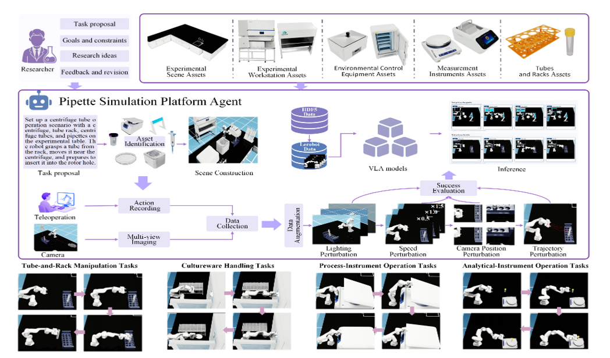

# Pipette

### An Embodied Simulation Platform, Benchmark, and Data-Efficient Augmentation Framework for Wet-Lab Robotics

[English](README.md) | [简体中文](README_zh-CN.md)

[](https://developer.nvidia.com/isaac-sim)
[](https://isaac-sim.github.io/IsaacLab/)
[](https://github.com/huggingface/lerobot)
[](https://www.python.org/)

**Pipette** is an embodied simulation platform for data-efficient wet-lab robot learning. It combines editable laboratory assets, language-guided task registration, teleoperation data collection, success-verified simulation augmentation, LeRobot dataset conversion, VLA policy training, and closed-loop evaluation in one workflow.

> 中文简介：Pipette 面向生物医学湿实验室机器人操作，提供从 USD 场景与任务注册、人工示教、仿真级数据增强、LeRobot 转换，到 ACT、SmolVLA、PI0 训练和闭环评测的一体化流程。

## Platform Overview

<p align="center">
  
</p>

## Highlights

- **Editable wet-lab assets:** standardized USD/USDZ assets with geometry, materials, collision bodies, physical properties, and task semantics.
- **Unified 11-task benchmark:** sample handling, cultureware manipulation, equipment lid operation, precise placement, and object relocation.
- **Physically consistent augmentation:** trajectories are re-executed in Isaac Sim with lighting, camera, speed, and action perturbations.
- **Automatic success verification:** task-specific evaluators filter augmented episodes and record interpretable failure reasons.
- **VLA-ready data pipeline:** HDF5 demonstrations are converted to LeRobot datasets with synchronized multi-view images, robot state, actions, and language instructions.
- **Unified policy evaluation:** ACT, SmolVLA, and PI0 share the same ZMQ policy interface and Isaac Lab evaluation environment.
- **Natural-language Agent:** command-line and web agents orchestrate scene construction, task registration, collection, augmentation, training, and evaluation.


## Benchmark Tasks

| Sample and Cultureware | Equipment Operation | Placement and Relocation |
|---|---|---|
| Pick up the test tube | Close the centrifuge lid | Place the centrifuge tube on the balance |
| Position the pipette over the petri dish | Open the centrifuge lid | Remove the centrifuge tube from the balance |
| Remove the petri dish from the incubator | Open the water bath lid | Place the pipette on the pipette stand |
| Place the petri dish in the incubator | Close the spectrophotometer lid | |

The benchmark covers sample handling, cultureware manipulation, equipment operation, and precision placement.

## Installation

### 1. Install the project and dependencies

Pipette uses two separate Conda environments:

- `env_isaaclab`: NVIDIA Isaac Sim 5.1.0 and Isaac Lab 2.3.0
- `lerobot`: LeRobot with ACT, SmolVLA, and PI0 support

Keeping the simulation and policy environments separate avoids Python and binary dependency conflicts.

#### Clone Pipette

```bash
git clone https://github.com/hbhuiyou/Pipette.git
cd Pipette
```

#### Install Isaac Sim 5.1 and Isaac Lab 2.3

Install the simulation environment with Python 3.11:

```bash
conda create -y -n env_isaaclab python=3.11
conda activate env_isaaclab
python -m pip install --upgrade pip
pip install "isaacsim[all,extscache]==5.1.0" --extra-index-url https://pypi.nvidia.com

cd ..
git clone --branch v2.3.0 https://github.com/isaac-sim/IsaacLab.git
cd IsaacLab
./isaaclab.sh --install
cd ../Pipette

pip install h5py
```

Install `pyzmq` with the Python interpreter bundled with the official Isaac Sim 5.1 installation:

```bash
cd /path/to/isaac-sim
./python.sh -m pip install pyzmq
cd /path/to/Pipette
```

A CUDA-capable NVIDIA GPU and a compatible NVIDIA driver are required. Run Pipette's collection, replay, augmentation, and evaluation scripts with the Isaac Sim and Isaac Lab environment.

#### Install LeRobot

Create a separate Python 3.12 environment, clone the official LeRobot repository, and install it in editable mode:

```bash
conda create -y -n lerobot python=3.12
conda activate lerobot
python -m pip install --upgrade pip

cd ..
git clone https://github.com/huggingface/lerobot.git
cd lerobot
pip install -e .
conda install -y -c conda-forge "ffmpeg=6.1.1"

pip install transformers accelerate peft
pip install num2words
pip install pyzmq
cd ../Pipette
```

Verify the installation:

```bash
lerobot-train --help
python -c "from lerobot.policies.act.modeling_act import ACTPolicy; from lerobot.policies.smolvla.modeling_smolvla import SmolVLAPolicy; from lerobot.policies.pi0.modeling_pi0 import PI0Policy; print('LeRobot installation OK')"
```

The Agent clears `PYTHONHOME` and `PYTHONPATH` when launching LeRobot commands to further prevent environment conflicts.

### 2. Configure local paths

The included task presets use example paths under `/root/gpufree-data`. Update the USD and dataset paths in `Data/task_registry.py`, or register your own scene through the Agent.

For Agent-managed execution:

```bash
cp Agent/local_config.example.env Agent/local_config.env
```

Then configure the relevant values:

```text
LEROBOT_PYTHON="/path/to/lerobot/python"
LEROBOT_MODEL_ROOT="/path/to/models"
AGENT_ENV_TEMPLATE_USD="/path/to/lab.usd"
AGENT_ASSET_DIR="/path/to/assets"
```

Do not commit API keys or cloud credentials stored in `Agent/local_config.env`.

## Quick Start

### Natural-language web interface

```bash
python Agent/web_agent.py
```

Open [http://127.0.0.1:7860](http://127.0.0.1:7860), then enter instructions such as:

```text
我要采集数据
增强试管抓取数据
把 HDF5 转成 LeRobot
训练 SmolVLA
用 PI0 运行推理评估
```

The terminal version is also available:

```bash
python Agent/agent.py
```

See [`Agent/README.md`](Agent/README.md) for Agent configuration, OpenAI-compatible intent parsing, web controls, and optional Tencent Hunyuan3D asset generation.

## Data Pipeline

### 1. Collect demonstrations

```bash
python Data/Keyboard_collection.py \
  --task_id pick_up_the_tube \
  --num_demos 30 \
  --dataset_file ./datasets/pick_up_the_tube.hdf5
```

Keyboard controls:

- `R`: save the current demonstration
- `SPACE`: skip the current demonstration
- `P`: stop collection

Gamepad collection is implemented in `Data/Gamepad_collection.py`.

### 2. Inspect or replay a dataset

```bash
python Data/inspect_hdf5_dataset.py \
  --file ./datasets/pick_up_the_tube.hdf5 \
  --show-attrs
```

### 3. Generate simulation-augmented data

```bash
python Data/Generate_data.py \
  --task_id pick_up_the_tube \
  --dataset_file ./datasets/pick_up_the_tube.hdf5 \
  --output_file ./datasets/pick_up_the_tube_aug.hdf5 \
  --num_envs 3 \
  --light_intensity_scales 0.8 \
  --temporal_speed_scales 1.2 \
  --camera_jitter_count 5 \
  --include_original \
  --headless
```

The augmentation workers re-execute trajectories and regenerate observations instead of editing saved images. The current pipeline supports:

- lighting-intensity perturbation;
- temporal speed perturbation and trajectory resampling;
- top, main, and wrist camera pose perturbation;
- bounded joint-action noise;
- task-level success filtering.

### 4. Convert HDF5 to LeRobot

Run this command in the LeRobot environment:

```bash
python Data/hdf5_to_lerobot.py \
  --hdf5-path ./datasets/pick_up_the_tube_aug.hdf5 \
  --repo-id pick_up_the_tube \
  --output-dir /absolute/path/to/lerobot/pick_up_the_tube \
  --fps 10 \
  --frame-filter fresh \
  --stride 3
```

The converter writes three RGB features, an 8-dimensional state, an 8-dimensional action, and the language instruction. Frames without a fresh visual observation are filtered to preserve temporal alignment.

## Policy Training

The batch entry point supports ACT, SmolVLA, and PI0:

```bash
python run_lerobot_batch_train.py \
  --model smolvla \
  --dataset-version aug \
  --dataset-root /path/to/lerobot/datasets \
  --output-root /path/to/checkpoints
```

Use `--dry-run` to inspect all generated `lerobot-train` commands before starting:

```bash
python run_lerobot_batch_train.py --model pi0 --dataset-version raw --dry-run
```

The manuscript uses the following training configuration:

| Policy | Batch size | Training steps | Additional settings |
|---|---:|---:|---|
| ACT | 32 | 15,000 | Default precision |
| SmolVLA | 8 | 20,000 | Default precision |
| PI0 | 4 | 20,000 | BF16, frozen vision encoder, expert-only training, gradient checkpointing |

## Closed-Loop Evaluation

Evaluation uses a LeRobot policy server and an Isaac Lab client connected through ZMQ.

Start the policy server in the LeRobot environment:

```bash
python Server/server_brain.py \
  --policy-path /path/to/checkpoint \
  --policy-type smolvla \
  --bind tcp://127.0.0.1:5555 \
  --device cuda
```

Start the matching Isaac Lab client:

```bash
python Client/inference_smolvla.py \
  --task-id pick_up_the_tube \
  --server-endpoint tcp://127.0.0.1:5555 \
  --episodes 100 \
  --output-json ./outputs/smolvla_pick_up_the_tube.json
```

Available clients:

- `Client/inference_act.py`
- `Client/inference_smolvla.py`
- `Client/inference_pi0.py`

Each episode records success or failure, failure reason, runtime, policy and control frequencies, and task-specific evaluator metrics.

## Results

The manuscript evaluates each policy on 100 episodes per task after training with 30 human demonstrations per task.

| Policy | Raw demonstrations | Raw + simulation augmentation |
|---|---:|---:|
| ACT | **65.5%** | 62.7% |
| SmolVLA | 44.1% | **74.7%** |
| PI0 | 40.4% | **46.5%** |

Simulation augmentation substantially improves SmolVLA and moderately improves PI0 on average. The effect is task-dependent: fine placement and contact-sensitive tasks may degrade when perturbations broaden the action distribution too aggressively.

## Repository Structure

```text
.
|-- Agent/                  # Natural-language CLI and web orchestration
|-- Client/                 # Isaac Lab policy evaluation clients
|-- Data/                   # Collection, replay, augmentation, conversion, and evaluators
|-- Server/                 # Unified LeRobot ZMQ inference server
|-- run_lerobot_batch_train.py
`-- README.md
```


## Limitations

- The current benchmark focuses on single-arm Franka Panda tasks.
- Systematic real-robot validation and sim-to-real transfer are future work.
- Success evaluators are currently task-specific and threshold-based.
- Language-guided task registration still requires users to verify USD paths, prim paths, camera settings, and success thresholds.

## Citation

If you use Pipette in your research, please cite the accompanying manuscript:

```bibtex
@misc{liu2026pipette,
  title  = {An Embodied Simulation Platform, Benchmark, and Data-Efficient Augmentation Framework for Wet-Lab Robotics},
  author = {Liu, Zhe and Jin, Huanbo and Du, Zhaohui and Wang, Zhe and Xu, He and Li, Peijia and Gu, Jiaming and Lu, Quan and Wang, Qi and Ji, Bin and Xiao, Ting},
  year   = {2026},
  note   = {Manuscript}
}
```

## Acknowledgements

Pipette builds on [NVIDIA Isaac Sim](https://developer.nvidia.com/isaac-sim), [Isaac Lab](https://isaac-sim.github.io/IsaacLab/), and [LeRobot](https://github.com/huggingface/lerobot). The organization of this README is inspired in part by [BioProVLA-Agent](https://github.com/no-guess/BioProVLA-Agent).
